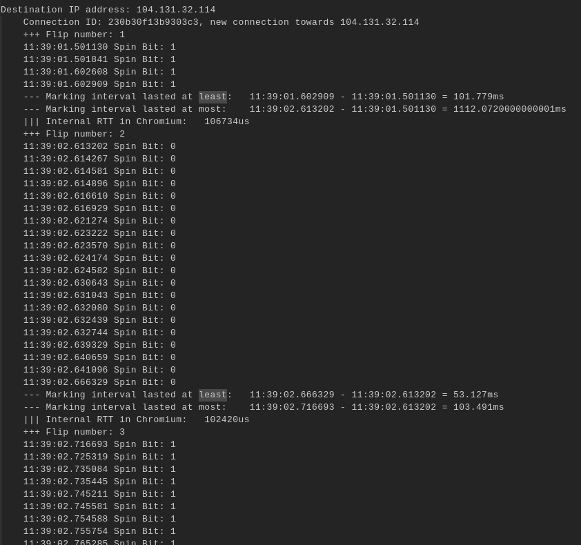

# Tools

A collection of tools to support [Spindump](https://github.com/EricssonResearch/spindump).

## Parser

Given a capture from the spindump-docker container, it produces a readable output with a summary of the Spin Bit flips. For example:

## Tester

Bash scripts that automates QUIC client calls to a given URL and produces both a log file and a set of Spindump captures.
